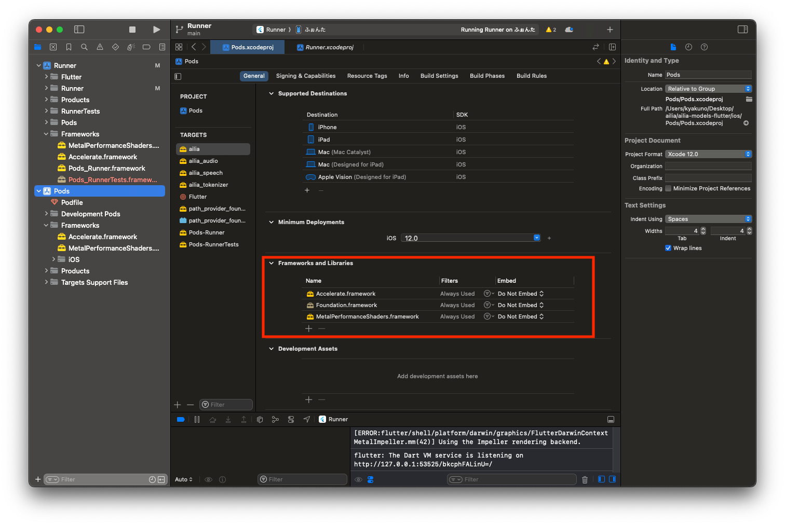

# ailia MODELS Flutter

A model library for flutter.

## Requirements

- flutter 3.19.6

## Install and Run

```
git clone https://github.com/axinc-ai/ailia-models-flutter.git
flutter pub get
flutter run
```

## Models

### Audio Processing

| | Model | Exported From | Supported Ailia Version | Blog |
|:-----------|------------:|:------------:|:------------:|:------------:|
| [whisper](lib/audio_processing/) | [Whisper](https://github.com/openai/whisper) | Pytorch | 1.2.10 and later | [JP](https://medium.com/axinc/whisper-%E6%97%A5%E6%9C%AC%E8%AA%9E%E3%82%92%E5%90%AB%E3%82%8099%E8%A8%80%E8%AA%9E%E3%82%92%E8%AA%8D%E8%AD%98%E3%81%A7%E3%81%8D%E3%82%8B%E9%9F%B3%E5%A3%B0%E8%AA%8D%E8%AD%98%E3%83%A2%E3%83%87%E3%83%AB-b6e578f55c87) |

### Image Classification

| | Model | Exported From | Supported Ailia Version | Blog |
|:-----------|------------:|:------------:|:------------:|:------------:|
| [resnet18](/lib/image_classification/) | [ResNet18]( https://pytorch.org/vision/main/generated/torchvision.models.resnet18.html) | Pytorch | 1.2.8 and later | |

### Natural Language Processing

| | Model | Exported From | Supported Ailia Version | Blog |
|:-----------|------------:|:------------:|:------------:|:------------:|
|[multilingual-e5](/lib/natural_language_processing/) | [multilingual-e5-base](https://huggingface.co/intfloat/multilingual-e5-base) | Pytorch | 1.2.15 and later | [JP](https://medium.com/axinc/multilingual-e5-%E5%A4%9A%E8%A8%80%E8%AA%9E%E3%81%AE%E3%83%86%E3%82%AD%E3%82%B9%E3%83%88%E3%82%92embedding%E3%81%99%E3%82%8B%E6%A9%9F%E6%A2%B0%E5%AD%A6%E7%BF%92%E3%83%A2%E3%83%87%E3%83%AB-71f1dec7c4f0) |

### Object Detection

| | Model | Exported From | Supported Ailia Version | Blog |
|:-----------|------------:|:------------:|:------------:|:------------:|
|[yolox](/lib/object_detection/) | [YOLOX](https://github.com/Megvii-BaseDetection/YOLOX) | Pytorch | 1.2.6 and later | [EN](https://medium.com/axinc-ai/yolox-object-detection-model-exceeding-yolov5-d6cea6d3c4bc) [JP](https://medium.com/axinc/yolox-yolov5%E3%82%92%E8%B6%85%E3%81%88%E3%82%8B%E7%89%A9%E4%BD%93%E6%A4%9C%E5%87%BA%E3%83%A2%E3%83%87%E3%83%AB-e9706e15fef2) |

## Import ailia SDK

This repository automatically downloads the ailia SDK.

When integrating the ailia SDK into a new application, add the following to pubspec.yaml.

```
  ailia:
    git:
      url: https://github.com/axinc-ai/ailia-sdk-flutter.git
      ref: main

  ailia_audio:
    git:
      url: https://github.com/axinc-ai/ailia-audio-flutter.git
      ref: main

  ailia_tokenizer:
    git:
      url: https://github.com/axinc-ai/ailia-tokenizer-flutter.git
      ref: main

  ailia_speech:
    git:
      url: https://github.com/axinc-ai/ailia-speech-flutter.git
      ref: main
```

Also, for macOS, it is necessary to set com.apple.security.app-sandbox to false in macos/Runner/Release.entitlements and macos/Runner/Debug.entitlements.

For iOS, it is necessary to add Accelerate.framework and MetalPerformanceShaders.framework to xcode project.

